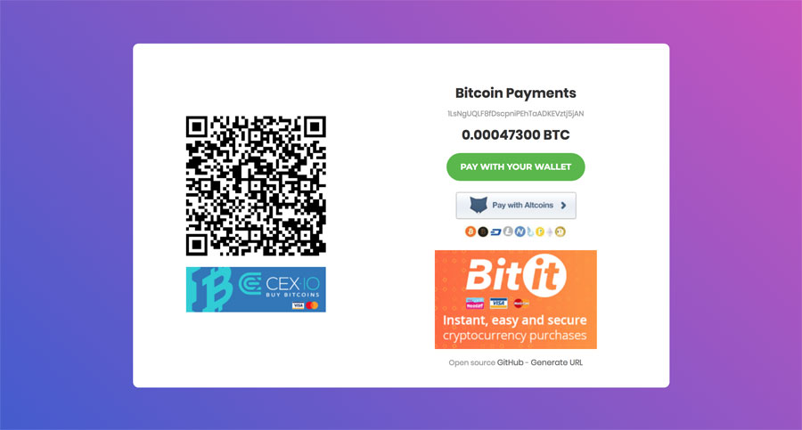
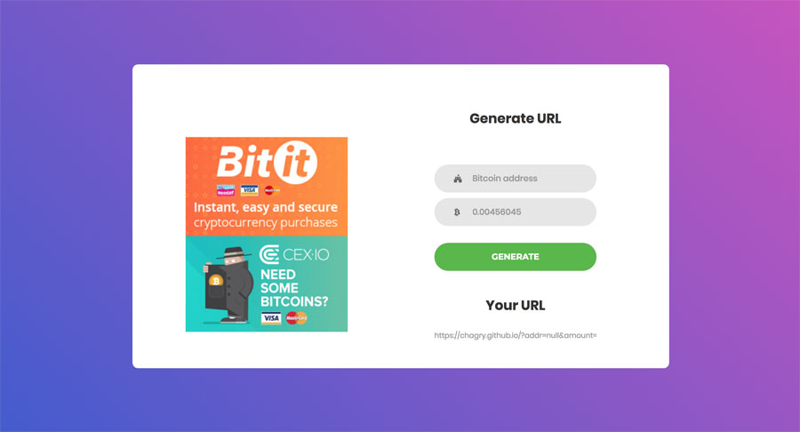

# Bitcoin payment
Simple HTML Page for Bitcoin Payments System.



# Utilisation

Vous pouvez appeler directement cette url ou de forker le projet.

L'url d'appel : https://ibtc.cash/?addr=YOUR_BITCOIN_ADDRESS&amount=YOUR_AMOUNT

Passer des variables dans l'URL avec $_GET.

| Variable | Params |
|----------|--------|
|**addr**|L'adress bitcoin qui recevra les fond envoyer.|
|**amount**|Le montent en bitcoin. ex : 0.0043|

Exemple d'utilisation.
```
https://ibtc.cash/?addr=1LsNgUQLF8fDscpniPEhTaADKEVztj5jAN&amount=0.00047300
```

Vous pouvez générer des urls directement [avec cette page](https://ibtc.cash/generate.html).



***

# License

Released under the [ MIT license](http://opensource.org/licenses/mit-license.php).
